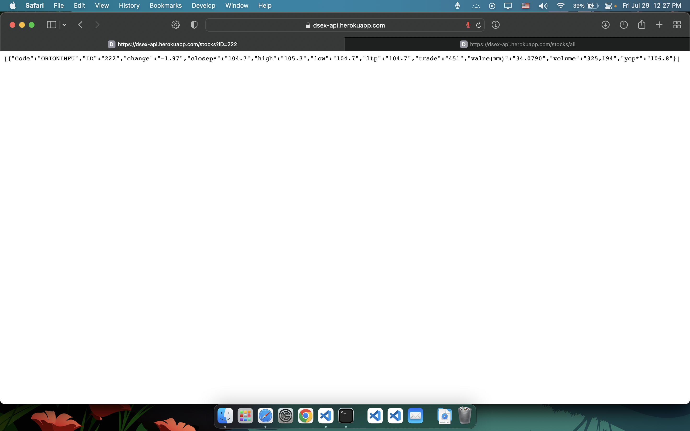
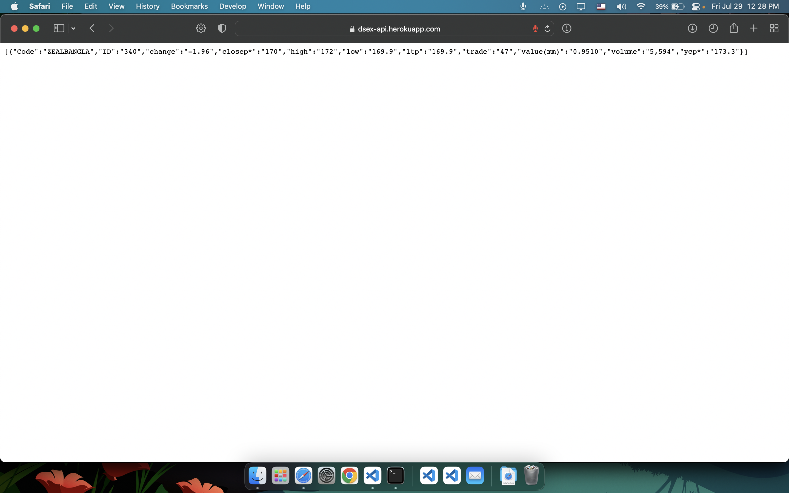

# stocks
### A Custom made api build using web scraping.
Tool Used <br>
* BeautifulSoup 
* flask
* requests
* gunicorn (For hosting on Heroku)

This app shows the stocks value from [DSEX](https://dsebd.org/dseX_share.php)(Dhaka Stock Exchange)

**It Has a limited amount of delay**
The values are in the time range of you hiting the api and you getting the values.<br>
[live demo](https://dsex-api.herokuapp.com)


**Screenshots**





### Devolopment
install the requiremnets
```
pip install -r requirements.txt
python3 app.py
```


